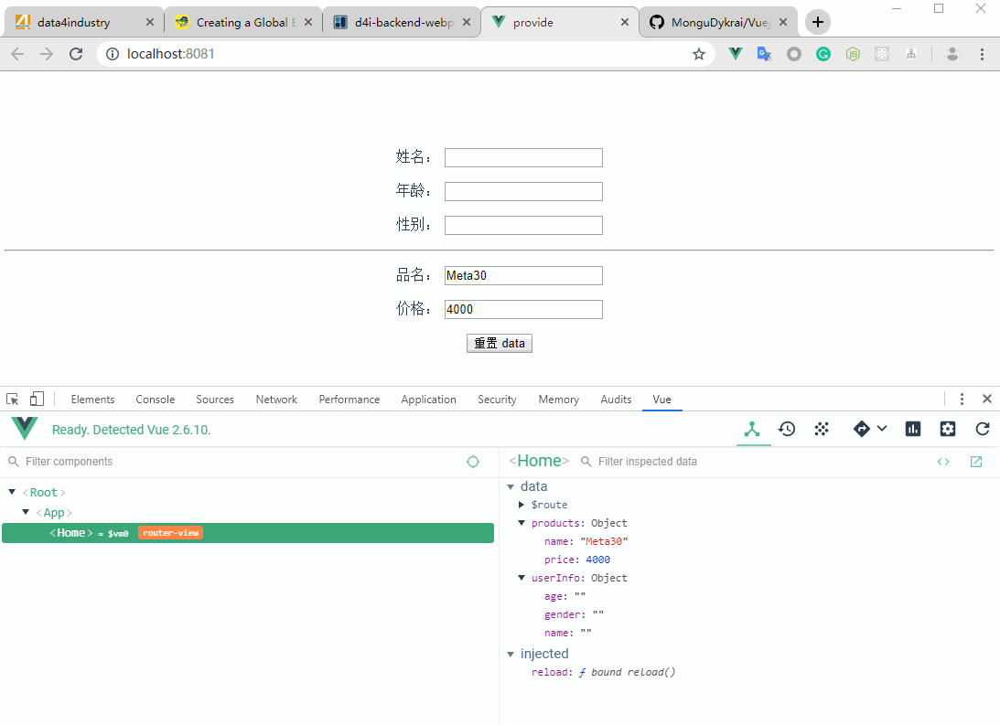
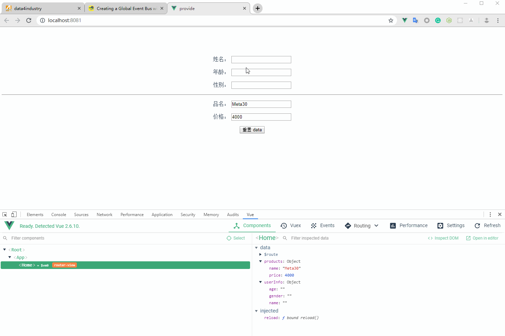

# README

## 项目结构

```
\src
  \views
    data.js
    Home.vue
  App.vue
```

## Home.vue

> 核心代码

```js
<script>
import { products } from "./data";

export default {
  inject: ["reload"],
  name: "home",

  data() {
    return {
      products,
      userInfo: {
        name: "",
        age: "",
        gender: ""
      }
    };
  },

  methods: {
    resetData() {
      this.reload();
    }
  }
};
</script>
```

## App.vue

> 核心代码

```js
<template>
  <div id="app">
    <div id="nav"></div>
    <router-view v-if="isRouterAlive"/>
  </div>
</template>

<script>
export default {
  provide() {
    return {
      reload: this.reload
    };
  },
  data() {
    return {
      isRouterAlive: true
    };
  },
  methods: {
    reload() {
      this.isRouterAlive = false;
      this.$nextTick(() => {
        this.isRouterAlive = true;
      });
    }
  }
};
</script>
```

## data.js

```js
export const products = {
  name: "Meta30",
  price: 4000
};
```

## 实现效果




